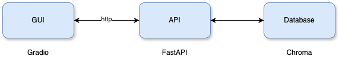
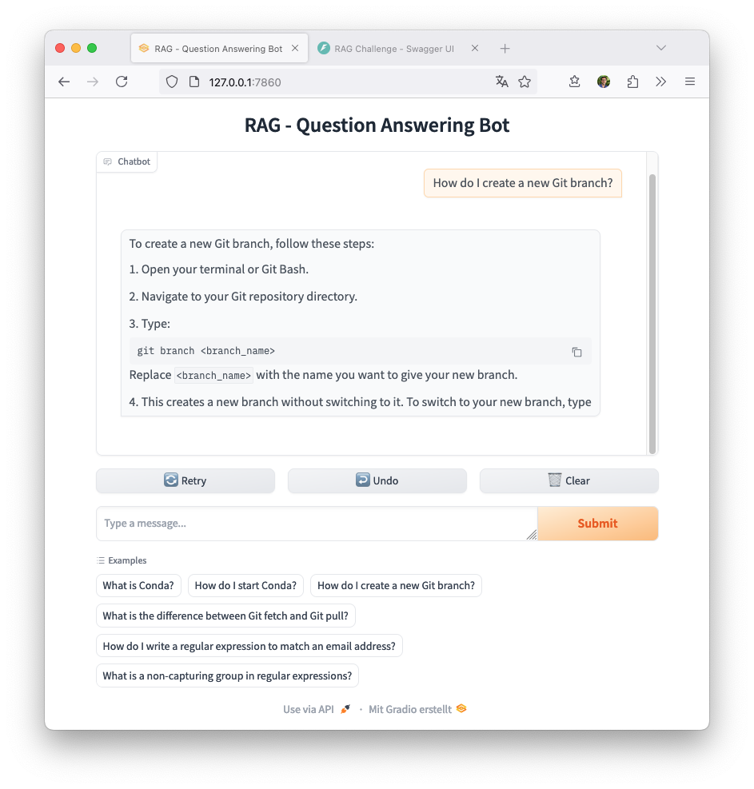
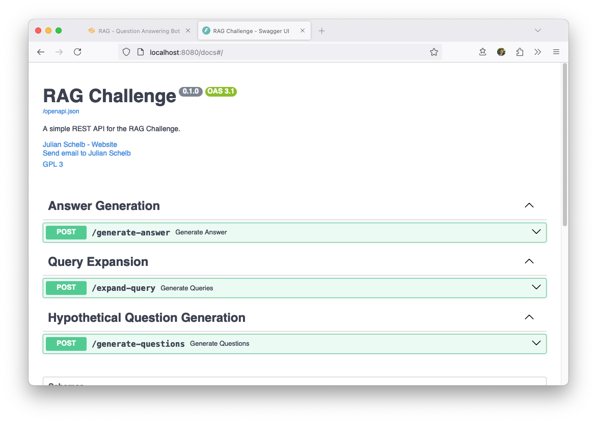
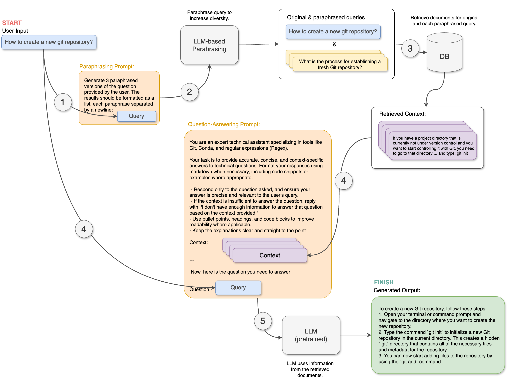

# RAG-based Knowledge Extraction 

This repo contains a project that focuses on building a scalable data pipeline using Retrieval Augmented Generation (RAG) techniques to process technical documentation. It enables users to ask and receive answers to specific technical questions by making the information more accessible and interactive.

<!-- toc -->
[GUI Demo](http://merkur72.inf.uni-konstanz.de:7860) | [API Demo](http://merkur72.inf.uni-konstanz.de:8080/docs)

## Overview

This repository contains a GUI component as well as a microservice backend for RAG-based question answering. It implements advanced features such as `Query Expansion` through paraphrasing of the original query and `Hypothetical Question Generation` to augment the documents in the database.


<p align="center">
  
</p>

- The REST API is implemented using [FastAPI](https://fastapi.tiangolo.com/) for efficient data handling.
- The user interface is built with [Gradio](https://gradio.app/) for easy interaction.
- The backend is built around [LangChain](https://langchain.com/) and integrated with the [Hugging Face](https://huggingface.co/) ecosystem, utilizing [Transformers](https://huggingface.co/transformers/) for advanced language processing.


## Screenshots

**User Interface:**
<p align="center">
  
</p>

**API Endpoints:**
<p align="center">
  
</p>


## Installation

This setup assumes that Python 3.10.8 is installed. If not, you can use [pyenv](https://github.com/pyenv/pyenv#installation) to manage your Python versions.

1. **Clone the repository**:
   ```bash
   git clone https://github.com/julianschelb/RAG-based-Knowledge-Extraction-Challenge
   cd RAG-based-Knowledge-Extraction-Challenge
   ```

2. **Install Poetry for dependency management**:
   ```bash
   pip install poetry
   ```

3. **Install project dependencies**:
   ```bash
   poetry install
   ```

4. **Set up Hugging Face credentials**:
   Log in to Hugging Face via the CLI:
   ```bash
   huggingface-cli login
   ```
   Follow the prompts to enter your Hugging Face token, which can be obtained from your [Hugging Face account settings](https://huggingface.co/settings/tokens).

5. Rename the `.env-template` file to `.env`.  

## Start Backend

To start a REST API implemented with FastAPI by running `python main.py`. Simply run the following command in your terminal:

```bash
python main.py
```

After starting the server, it should be running on port 8080 on localhost. To access the API documentation, visit: [http://localhost:8080/docs#/](http://localhost:8080/docs#/)

## Start Frontend

To start the user interface of the project, run the following command:

```bash
python src/ragchallenge/gui/main.py
```

Afterwards, the GUI should be reachable at: [http://localhost:7860/](http://localhost:7860/)


## Additional Information

This section provides a brief overview of how documents are processed, as well as the implementation of the retrieval and question-answering process.

### Document Ingestion and Processing

Following, we describe the process we implemented to read the markdown files and store them in a vector store.


**Phase 1: Document Splitting**

1. First, we read all markdown files in `/data/raw` as plain text files.
2. We proceed by splitting all documents by markdown headers. The intuition is to split the documents by the "##" header, assuming that everything within a section is related to the same topic. The file name and the header title are stored as metadata.
3. We filter out very small sections with a token count of fewer than 25.
4. Finally, we split the subsections into smaller, manageable chunks for the encoder, while retaining the metadata.

**Phase 2: Document Augmentation**

1. We augment each chunk with the original file title and section title to provide more contextual information. This helps the encoder model distinguish between different domains such as Conda, Git, Regex, etc.
2. Additionally, we augment each chunk using `Hypothetical Question Generation`. The idea is to ask a generative language model to come up with questions a user might ask, further assisting the encoder model in matching the chunk with a potential user query.

**Example of a processed document:**

The final document is augmented with the original section title and hypothetical questions.

```
Page title: Initializing A Repository In An Existing Directory
Filename: git tutorial

Related Questions:
- 1. If I have a directory that is not currently being version controlled with Git, what command do I type to start controlling it with Git? (Answer: $ git init)
- 2. Where in the file system should I navigate to in order to type the command to start controlling my project directory with Git? (Answer: To the project directory)
- 3. How do the directions for navigating to the project directory differ depending on the operating system? (Answer:

Page Content:
If you have a project directory that is currently not under version control and you want to start controlling it with Git, you first need to go to that project's directory. If you've never done this, it looks a little different depending on which system you're running: for Linux:
$ cd /home/user/my_project for macOS:
$ cd /Users/user/my_project for Windows:
$ cd C:/Users/user/my_project and type:
$ git init This creates a new subdirectory named .git that contains all of your necessary repository files - a Git repository skeleton. At this point, nothing in your project is tracked yet. See Git Internals for 26 more information about exactly what files are contained in the .git directory you just created.

If you want to start version-controlling existing files (as opposed to an empty directory), you should probably begin tracking those files and do an initial commit. You can accomplish that with a few git add commands that specify the files you want to track, followed by a git commit:
$ git add *.c
```

### Retrieval and Question-Answering Process

<p align="center">
  
</p>


1. The user enters a query.
2. To perform `Query Expansion`, we ask a model to paraphrase the original query, generating three alternative queries. The intuition is that the model can generate queries focusing on different aspects of the input prompt.
3. For each paraphrased query, as well as the original one, we retrieve *k* documents from the vector store.
4. The context and the original query are combined in a question answering prompt.
5. Finally, a large language model (LLM) is asked to use the combined context to answer the original query.


**Example for generated Hypothetical Questions:**

```
Document: Conda is an open-source package management system and environment management system that runs on Windows, macOS, and Linux. Conda quickly installs, runs, and updates packages and their dependencies.


Generated Hypothetical Questions:
1. How does Conda differ from other package management systems in terms of installation and updating procedures?
2. Can you describe the cross-platform compatibility of Conda, and how does it affect its usability for developers working on different operating systems?
3. How does Conda ensure that the dependencies of a package are also installed and updated alongside it, and what impact does this have on the overall package management experience?
```

## Further Thoughts on System Design and Scalability

