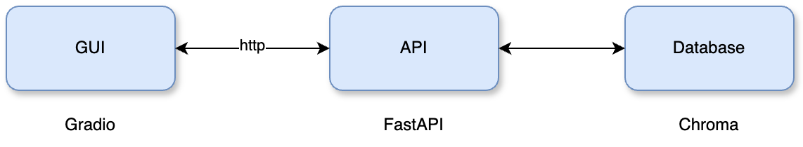

# RAG-based Knowledge Extraction 

This repo contains a project that focuses on building a scalable data pipeline using Retrieval Augmented Generation (RAG) techniques to process technical documentation. It enables users to ask and receive answers to specific technical questions by making the information more accessible and interactive.

<!-- toc -->


## Overview

This repository contains a GUI component as well as a microservice backend for RAG-based question answering. It implements advanced features such as query expansion through paraphrasing of the original query and hypothetical question generation to augment the documents in the database.

<p align="center">
  
</p>


- The REST API is implemented using [FastAPI](https://fastapi.tiangolo.com/) for efficient data handling.
- The user interface is built with [Gradio](https://gradio.app/) for easy interaction.
- The backend is built around [LangChain](https://langchain.com/) and integrated with the [Hugging Face](https://huggingface.co/) ecosystem, utilizing [Transformers](https://huggingface.co/transformers/) for advanced language processing.

## Installation

This setup assumes that Python 3.10.8 is installed. If not, you can use [pyenv](https://github.com/pyenv/pyenv#installation) to manage your Python versions.

1. **Clone the repository**:
   ```bash
   git clone https://github.com/julianschelb/RAG-based-Knowledge-Extraction-Challenge
   cd RAG-based-Knowledge-Extraction-Challenge
   ```

2. **Install Poetry for dependency management**:
   ```bash
   pip install poetry
   ```

3. **Install project dependencies**:
   ```bash
   poetry install
   ```

4. **Set up Hugging Face credentials**:
   Log in to Hugging Face via the CLI:
   ```bash
   huggingface-cli login
   ```
   Follow the prompts to enter your Hugging Face token, which can be obtained from your [Hugging Face account settings](https://huggingface.co/settings/tokens).

## Start Backend

To start a REST API implemented with FastAPI by running `python main.py`. Simply run the following command in your terminal:

```bash
python main.py
```

After starting the server, it should be running on port 8080 on localhost. To access the API documentation, visit: [http://localhost:8080/docs#/](http://localhost:8080/docs#/)

## Start Frontend

To start the user interface of the project, run the following command:

```bash
python src/ragchallenge/gui/main.py
```

Afterwards, the GUI should be reachable at: [http://localhost:7860/](http://localhost:7860/)


## Additional Information

This section provides a brief overview of how documents are processed, as well as the implementation of the retrieval and question-answering process.

### Document Ingestion and Processing

Following, we describe the process we implemented to read the markdown files and store them in a vector store.


**Phase 1: Document Splitting**

1. First, we read all markdown files in `/data/raw` as plain text files.
2. We proceed by splitting all documents by markdown headers. The intuition is to split the documents by the "##" header, assuming that everything within a section is related to the same topic. The file name and the header title are stored as metadata.
3. We filter out very small sections with a token count of fewer than 25.
4. Finally, we split the subsections into smaller, manageable chunks for the encoder, while retaining the metadata.

**Phase 2: Document Augmentation**

1. We augment each chunk with the original file title and section title to provide more contextual information. This helps the encoder model distinguish between different domains such as Conda, Git, Regex, etc.
2. Additionally, we augment each chunk using `Hypothetical Question Generation`. The idea is to ask a generative language model to come up with questions a user might ask, further assisting the encoder model in matching the chunk with a potential user query.


### Retrieval and Question-Answering Process


1. The user enters a query.
2. To perform `Query Expansion`, we ask a model to paraphrase the original query, generating three alternative queries. The intuition is that the model can generate queries focusing on different aspects of the input prompt.
3. For each paraphrased query, as well as the original one, we retrieve *k* documents from the vector store.
4. Finally, a large language model (LLM) is asked to use the combined context to answer the original query.


## Further Thoughts on System Design and Scalability

